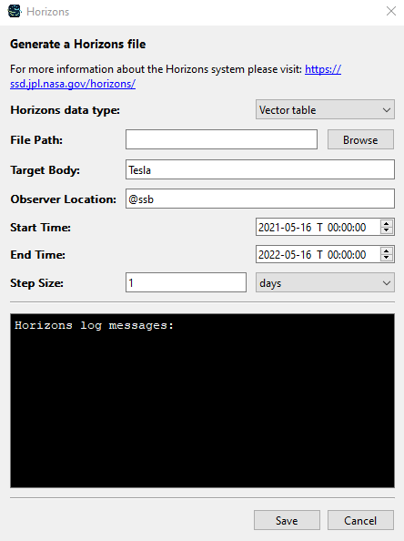

Since version 0.18.0 of OpenSpace there is a new feature that allows our users to access Horizons data directly via OpenSpace, without needing to go to the [Horizons website](https://ssd.jpl.nasa.gov/horizons.cgi). This feature can be found in the OpenSpace launcher by pressing a series of buttons:

1. Press the *Edit* button close to the profile selection
2. Press the *Edit* button close to the asset selection
3. In the top right corner of the new window press the *New Asset* button
4. Finally press the *Generate Horizons File* button
5. At this point you should see the window shown in the image below

# The Horizons Tool
In the new window there are a few places where you can input specifications for what Horizons data you want to access. Once you have entered all information you can press the *Save* button at the bottom of the window. At this point OpenSpace will ask the Horizons service for the data you want and download it and store it on your computer. This wiki will go through every step of this process and explain what each field in the UI means. This process is very similar to how you would do it on the Horizons web page. Read more about that [here](horizons-web).

The following sections describe each field of the Horizons UI.

## Horizons Data Type
Select what format you want your data in, OpenSpace supports both **Vector Table** and **Observer Table**. However, we recommend the **Vector Table** format since this will give a better match between your data and the rest of OpenSpace.

## File Path
Click the *Browse* button to browse with the file explorer to specify where the data should be stored on your computer. This is required to be specified for the data to be downloaded. If there was any issue with the download, then there will instead be an error file stored at this location. The error file will be named <code>XXX_error.txt</code> where <code>XXX</code> is the name of the file you specified. If you adjust your input to fix this issue and the download succeeds this time, this error file will be deleted automatically.

## Target Body
Here you specify the name of the object you want to get data for. For example, if you want data for the Voyager 1 spacecraft you can write <code>Voyager 1</code> here. Horizons have data for many different objects from spacecraft, planets, moons, comets and asteroids to Lagrange points and more.

In this and the **Observer Location** field the characters <code>¤ < > § £ ´ ¨ €</code> and other special characters from other languages are not allowed. Additionally the characters <code>' =</code> have some limitations in how they can be used.

## Observer Location
Here you specify the name of the reference point you want for the data. For example, if you want to show the movement of the spacecraft Voyager 1 over time, the reference point should probably be the Sun or the Solar System Barycenter. But if you instead want to show a satellite that orbits around Mars, the reference point should probably be Mars.

## Start Time
The start of the time range you want data for.

## Stop Time
The end of the time range you want data for.

## Step Size
The step size is the temporal resolution you want the data to have. The default value is 1 sample per day.

## Horizons Log Messages
This is a log that only displays messages related to your input in this tool and the download of the data. When using this tool there are a few different issues that you can encounter and they will be explained in more detail below. All of the issues you will encounter will be detailed in this log and the messages will guide you towards a fix. If OpenSpace fails with getting this helpful information there will be an error file stored at the specified location in the **File Path** field. This file might contain some useful information about what went wrong and how it can be fixed.

# Issues and Solutions
There are a few different things that can go wrong while using this tool. Most of the issues are related to the input and can be fixed with some adjustments. The particular parameters that need to be adjusted will be highlighted in red and there will be some messages in the Horizons log that can give you tips on how to fix it. Some common errors and solutions are explained below.

## No Matching Target
The target you searched for could not be found. Check that the name has been spelt correctly and you can also add a <code>*</code> at the end of the name to widen your search. If you still cannot find what you are looking for, it is possible that there might be an alternative name for it in the Horizons database or that it does not exist.

## Multiple Matching Targets
Multiple matches were found in the Horizons database for the target you searched for. There should be an added drop down menu close to the **Target Body** field where you can select one of the matches. If none of them is what you were looking for, you can keep the first item in the list selected and write a new name to search for.

## Target and Observer Are the Same
This issue only happens when the **Observer Table** format is selected and happens when the target and the observer are the same object. This can be fixed by either changing the observer or the target to something else. If the **Vector Table** format is selected, then this is allowed even if it does not give any useful results (all the data will be zero).

## No Matching Observer
The observer location you searched for could not be found. Check that the name has been spelt correctly and you can also add a <code>@</code> to the beginning of the name to widen your search. If you still cannot find what you are looking for, it is possible that there might be an alternative name for it in the Horizons database or that it does not exist.

## Multiple Matching Observers
Multiple matches were found in the Horizons database for the observer you searched for. There should be an added drop down menu close to the **Observer Location** field where you can select one of the matches. If none of them is what you were looking for, you can keep the first item in the list selected and write a new name to search for.

## Multiple Matching Observer Stations
The observer you searched for found multiple matching observer stations in the Horizons database. There should be an added drop down menu close to the **Observer Location** field where you can select one of the matches. If none of them is what you were looking for, you can keep the first item in the list selected and write a new name to search for. If you did not intend to search for an observer station, try to add a <code>@</code> to the beginning of the name to widen your search.

## Time Range Is Outside Available Time Range for Target
Each target has data available in a certain time range and this issue happens when you ask for data outside of that range. There should be an added button *Import Time Range* close to the time selection fields. This button will set the time selection to the entire available range for the current target. There will also be a message in the Horizons log detailing what this range is for the target. This can be helpful in adjusting the time selection to be within the range. If the button or the message does not show up, then there will be an error file stored at the specified location in the **File Path** field and this file might contain some useful information on how to fix the issue.

## The Projected Size of the Data Is Too Large
This problem arises when you ask for data over a very long time span and at the same time have a very fine resolution. Horizons data have a limit on how big the files can be and if the output is projected to exceed that limit, this issue occurs. To fix this issue you need to either shorten the time span or decrease the resolution. In some cases, it might be necessary to do both. You can also separate your request into several files. For example, first you can ask for the first 10 years of data in one file and then ask for the remaining 10 years of data in a second file. These files can then be combined in OpenSpace to show all of the data without sacrificing the resolution.

## Time Step Is Too Large
This happens when the time step is set to a very large value and can be fixed by shortening it.

## Insufficient Data
This issue is encountered when the Horizons service does not have enough data loaded at the moment to calculate all the data your request requires. Specifically, there is not enough data that can determine a clear path from the observer to the target at the selected time range. To address this issue you can try to switch to another observer or adjust the time selection. However, you can also just wait a few days and it can be fixed. This is an issue with the Horizons service and not an issue with OpenSpace or how it communicates with Horizons.

## Unknown Error
This error has not been encountered by the developers before and we would love to hear from you what happened so we can improve the software. When OpenSpace encounters something it does not understand regarding the Horizons tool, there will be an error file stored at the specified location in the **File Path** field. Please keep this file and attach it to any communication you have with us regarding your issue. Feel free to contact us on our [slack](openspacesupport.slack.com) or create a new issue on our [GitHub](https://github.com/OpenSpace/OpenSpace).
