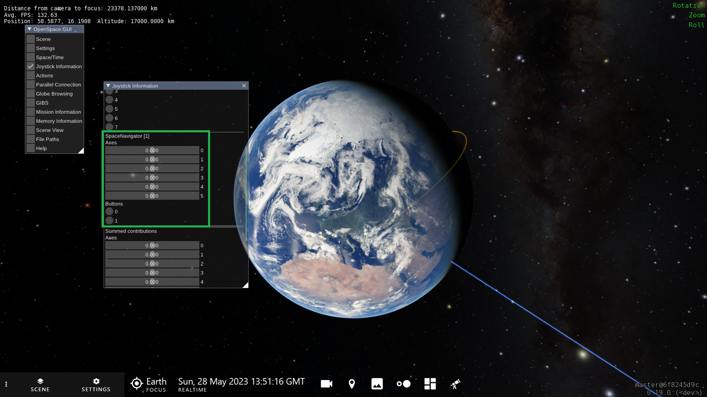

# Customizing the joystick navigation
This page will go in-depth into how to customize the joystick navigation to your own liking. If you want to learn more about the default joystick navigation in OpenSpace, see [Joystick Navigation](../../users/navigation/joysticks).

To start, you will need an asset file to edit. If you are using a controller that matches one of the assets that OpenSpace already provides (Xbox, PS4, SpaceMouse, etc.) it is recommended that you start with a copy of that matching asset and place it in your `user\data\assets` folder. However, if the controller you will use does not match any provided asset, it is still recommended to start with one of the assets that are provided, such as the `space-mouse-compact` asset. The steps will be the same in both cases with the exception that the new controller will need some additional setup, see [Setup new joystick type](#Setup-new-joystick-type) before moving on to the customization.

## Bind camera navigation to a joystick axis
To bind a camera movement to an axis of the joystick you will need the function `openspace.navigation.bindJoystickAxis` that takes eight arguments. Below is a list that describes each argument in detail. If you are customizing an already existing asset then you probably do not want to add a new camera movement binding, instead, you might want to alter the pre-existing ones. To customize a camera movement it is most likely only necessary to change a few of the input values in the pre-existing function call to the function `openspace.navigation.bindJoystickAxis`.

1. The name of the controller you want to use (for more info on how to find this name, see [Joystick Navigation](../../users/navigation/joysticks)). It is important that this name matches the name that OpenSpace detects for the controller.

2. The index of which axis on the controller you want to bind the camera movement to. This is distinct for the type of controller you will use and to find these values for a new controller see [Setup new joystick type](#Setup-new-joystick-type). If you are using an already supported controller, you can use the "map" at the top of the asset to find the indices. Either you can put in the indices directly or you can use the map with the descriptive name such as `controller.RightTrigger` or `controller.LeftThumbStick.LeftRight`.

3. The type of camera movement you want this axis to do. This defines how the camera will move in OpenSpace when you move the specified axis of the controller. Must be one of the identifiers in the following list:

| Identifier   | Description                                                             |
|--------------|-------------------------------------------------------------------------|
| "None"       | Unbinds the axis, no camera movement is applied. Default value from the start. |
| "Orbit X"    | Move the camera in the left/right direction in relation to the focus, while still keeping the same distance. The camera will move as if it was orbiting the focus. |
| "Orbit Y"    | Move the camera in the up/down direction in relation to the focus, while still keeping the same distance. The camera will move as if it was orbiting the focus. |
| "Zoom"       | Move the camera closer or further away from the focus                   |
| "Zoom In"    | Move the camera closer to the focus                                     |
| "Zoom Out"   | Move the camera further away from the focus                             |
| "LocalRoll"  | Roll the camera (clockwise) in relation to the middle of the view       |
| "GlobalRoll" | Roll the camera (clockwise) in relation to the focus                    |
| "Pan X"      | Turn the camera left/right in relation to the view                      |
| "Pan Y"      | Turn the camera up/down in relation to the view                         |

4. (Optional) Whether or not this axis should be inverted. This is a common setting in video games. Defaults to `false`.

5. (Optional) The type of joystick that this axis represents on the controller. The options are either `"JoystickLike"` or `"TriggerLike"`. A joystick is `"TriggerLike"` if it can only be pressed or pushed in one direction. A `"JoystickLike"` axis can be pushed in two directions, for example, left **and** right, or up **and** down. Defaults to `"JoystickLike"`.

6. (Optional) Whether or not this axis is "sticky". In most cases, this should be set to `false`. An axis is "sticky" if, when you let go of it, the values it represents in the software do not go back to the default. Another sign is that the longer you push it, the value, and therefore the movement, gets more and more extreme over time and does not stop or slow down when you let go. Defaults to `false`.

7. (Optional) Whether or not the movement for this axis should be reversed. In the case of a `"JoystickLike"` axis, this is the same as inverting the axis (which was argument number 4). However, in the case of a `"TriggerLike"` axis, this can reverse the camera movement for the trigger. For example, if the `"LocalRoll"` movement type is bound to a trigger, you can only roll OpenSpace clockwise when you press the trigger, since the trigger can only go in one direction. To make the camera roll counter-clockwise instead, you would need to reverse the movement with this argument. Defaults to `false`.

8. (Optional) Sensitivity value for this axis. Can be used to fine-tune the sensitivity for all axes individually. Defaults to `1.0`. A value larger than `1.0` would lead to the axis becoming more sensitive and a value that is smaller than `1.0` would lead to the axis being less sensitive to input. There is also a global sensitivity property that can be adjusted in the GUI, under *Settings*, *Navigation Handler*, *Orbital Navigator* and then *Joystick Sensitivity* (identifier `NavigationHandler.OrbitalNavigator.JoystickSensitivity`). Note that this will affect all connected controllers and all of their axes.

Here is an example asset with the SpaceMouse:
~~~lua
  local SpaceMouse = {
    -- Axes
    Push = {
      LeftRight = 0,
      BackForth = 1,
      UpDown = 2
    },
    Twist = 5,
    Tilt = {
      LeftRight = 4,
      BackForth = 3
    },

    -- Buttons
    LeftButton = 0,
    RightButton = 1
  }

  asset.onInitialize(function()
    local controller = SpaceMouse;
    local name = "SpaceNavigator";

    openspace.navigation.bindJoystickAxis(name, controller.Push.LeftRight, "Orbit X", false, "JoystickLike", true, false, 40.0)
    openspace.navigation.bindJoystickAxis(name, controller.Push.BackForth, "Orbit Y", false, "JoystickLike", true, false, 40.0)
    openspace.navigation.bindJoystickAxis(name, controller.Twist, "Pan X", true, "JoystickLike", true, false, 40.0)
    openspace.navigation.bindJoystickAxis(name, controller.Tilt.BackForth, "Pan Y", false, "JoystickLike", true, false, 35.0)
    openspace.navigation.bindJoystickAxis(name, controller.Push.UpDown, "Zoom", false, "JoystickLike", true, false, 40.0)
    openspace.navigation.bindJoystickAxis(name, controller.Tilt.LeftRight, "LocalRoll", false, "JoystickLike", true, false, 35.0)
  end)
~~~

## Bind a property to a joystick axis
To control an OpenSpace property using an axis on a controller you will need the function `openspace.navigation.bindJoystickAxisProperty` that takes seven arguments. Below is a list that describes each argument in detail.

1. The name of the controller you want to use (for more info on how to find this name, see [Joystick Navigation](../../users/navigation/joysticks)). It is important that this name matches the name that OpenSpace detects for the controller.

2. The index of which axis on the controller you want to bind the property to. This is distinct for the type of controller you are using and to find these values for a new controller see [Setup new joystick type](#Setup-new-joystick-type). If you are using an already supported controller, you can use the "map" at the top of the asset to find the indices. Either you can put in the indices directly or you can use the map with the descriptive name such as `controller.RightTrigger` or `controller.LeftThumbStick.LeftRight`.

3. The full identifier for the property you want to control with this axis on the controller. A tip to find this identifier is to first run OpenSpace normally and change the property with the normal GUI, then you can look at the Script Log and see the full name of the property you just changed, for more information about the Script Log see [The Script Log](../../users/commandline#the-script-log).

4. (Optional) The minimum value allowed to be set for this property using the axis. Defaults to `0.0`.

5. (Optional) The maximum value allowed to be set for this property using the axis. Defaults to `100.0`.

6. (Optional) Whether or not this axis should be inverted. This is a common setting in video games. Defaults to `false`.

7. (Optional) Whether or not the property change should be forwarded to other connected nodes or sessions. This is similar to the `"isLocal"` parameter for actions. Defaults to `true`.

Here is an example asset with the Earth scale bound to the right trigger on an Xbox controller:
~~~lua
  local XBoxController = {
    -- Axes
    LeftThumbStick = {
      LeftRight = 0,
      UpDown = 1
    },
    RightThumbStick = {
      LeftRight = 2,
      UpDown = 3
    },
    LeftTrigger = 4,
    RightTrigger = 5,

    -- Buttons
    A = 0,
    B = 1,
    X = 2,
    Y = 3,
    LB = 4,
    RB = 5,
    Back = 6,
    Start = 7,
    LeftStickButton = 8,
    RightStickButton = 9,
    DPad = {
      Up = 10,
      Right = 11,
      Down = 12,
      Left = 13
    }
  }

  asset.onInitialize(function()
    local controller = XBoxController;
    local name = "Xbox Controller";

    -- Bind Right trigger to Earth Scale
    openspace.navigation.bindJoystickAxisProperty(name, controller.RightTrigger, "Scene.Earth.Scale.Scale", 0.1, 100, false, true);
  end)
~~~

## Bind a script to a joystick button
Binding a custom script to a joystick button is done with the function `openspace.navigation.bindJoystickButton` that takes six arguments. Below is a list that describes each argument in detail.

1. The name of the controller you want to use (for more info on how to find this name, see [Joystick Navigation](../../users/navigation/joysticks)). It is important that this name matches the name that OpenSpace detects for the controller.

2. The index of which button on the controller you want to bind the script to. This is distinct for the type of controller you are using and to find these values for a new controller see [Setup new joystick type](#Setup-new-joystick-type). If you are using an already supported controller, you can use the "map" at the top of the asset to find the indices. Either you can put in the indices directly or you can use the map with the descriptive name such as `controller.A` or `controller.DPan.Left`.

3. The script that should be executed when the button is activated. A tip to find this script is to use the Script Log, for more information see [The Script Log](../../users/commandline#the-script-log).

4. Description of the script that the button will execute when the button is activated.

5. (Optional) When the button should be interpreted as activated, defaults to `"Press"`. This must be one of the identifiers in the following list:

| Identifier | Description                                     |
| ---------- | ----------------------------------------------- |
| "Idle"     | When the button is **not** pressed              |
| "Press"    | When the button is pressed                      |
| "Repeat"   | When the button is held pressed                 |
| "Release"  | When the button was pressed and is not released |

6. (Optional) Whether or not the script should be forwarded to other connected nodes or sessions. This is similar to the `"isLocal"` parameter for actions. Defaults to `true`.

Here is an example asset that switches focus when pressing the trigger buttons on an Xbox controller:
~~~lua
  local XBoxController = {
    -- Axes
    LeftThumbStick = {
      LeftRight = 0,
      UpDown = 1
    },
    RightThumbStick = {
      LeftRight = 2,
      UpDown = 3
    },
    LeftTrigger = 4,
    RightTrigger = 5,

    -- Buttons
    A = 0,
    B = 1,
    X = 2,
    Y = 3,
    LB = 4,
    RB = 5,
    Back = 6,
    Start = 7,
    LeftStickButton = 8,
    RightStickButton = 9,
    DPad = {
      Up = 10,
      Right = 11,
      Down = 12,
      Left = 13
    }
  }

  asset.onInitialize(function()
    local controller = XBoxController;
    local name = "Xbox Controller";

    -- Switch focus in the interesting nodes list
    -- Previous
    openspace.navigation.bindJoystickButton(
      name,
      controller.LB,
      "openspace.navigation.targetPreviousInterestingAnchor(); openspace.navigation.retargetAnchor();",
      "Switch target to the previous interesting node",
      "Press",
      true
    )

    -- Next
    openspace.navigation.bindJoystickButton(
      name,
      controller.RB,
      "openspace.navigation.targetNextInterestingAnchor(); openspace.navigation.retargetAnchor();",
      "Switch target to the next interesting node",
      "Press",
      true
    )
  end)
~~~

# Setup new joystick type
When connecting a new controller or joystick to OpenSpace the first step is to get a good mapping of what buttons and axes the controller has and what indices they are connected to. To get an overview of the joysticks and its axes and buttons you can use the connected joysticks list in OpenSpace. You can access this list by pressing the *F1* button on the keyboard and you will see the old GUI interface of OpenSpace pop up. In the window called **OpenSpace GUI**, press the empty checkbox next to **Joysticks Information**. This will open a new window and here all the connected joysticks will be listed. In this list, you can search for your joystick. The items in the list called *3Dconnexion KMJ Emulator* or *Summed contributions* can be ignored. Once you have found your controller you will see two numbered lists of axes and buttons with a slider and button respectively. See the image below:

Now we can begin to explore the controller. What we want to have in the end is a list of all the axes and buttons and which index in the OpenSpace list they correspond to. To start it can be good to have descriptive names for each button and axis you can find on the controller, or at least the ones that you are interested in.

Now that we have a clear image of what the controller is capable of, we need to figure out how it is connected to OpenSpace. Let's start with the axes, we want to identify which index in the OpenSpace list corresponds to each axes on the controller. Choose one axis and move it around a little bit on the controller, you should see one or more sliders reacting to your movement in the list in OpenSpace. If you see several sliders reacting to your movement, try to isolate your movement to only one direction such as up/down or left/right. When you are certain of which index reacted to your input to the axis you can note that down and move on to the next axis. Below is an image to show how it can look like when one of the axes has been moved:

For the buttons, we will use the same strategy, push one button a few times and see which of the buttons in OpenSpace reacts, note down that number, and move on to the next. Now that we have a clear image of how each button and axis relate to the list in OpenSpace we could build a map in our asset. Below is an image to show how it can look like when one of the buttons is pressed:

In each joystick asset file that OpenSpace provides there will be a section at the top that looks similar to this:

~~~lua
-- Name of the controller
local XBoxController = {
  -- Axes
  LeftThumbStick = {
    LeftRight = 0,
    UpDown = 1
  },
  RightThumbStick = {
    LeftRight = 2,
    UpDown = 3
  },
  LeftTrigger = 4,
  RightTrigger = 5,

  -- Buttons
  A = 0,
  B = 1,
  X = 2,
  Y = 3,
  LB = 4,
  RB = 5,
  Back = 6,
  Start = 7,
  LeftStickButton = 8,
  RightStickButton = 9,
  DPad = {
    Up = 10,
    Right = 11,
    Down = 12,
    Left = 13
  }
}
~~~

This is the map of the controller that tells OpenSpace how each axis and button relate to the indices in the list that OpenSpace sees. Now with all the information you now have about your controller, you can make your own map. Start with a name for your controller, in the example above it is called `XBoxController`. Then you can start with the axes, in the example above there are four joysticks that each have one to two axes. There are the two joysticks that can move both left/right, and up/down, then there are the two triggers that only have one axis each. To add an axis to the list you add its name (no spaces or special characters) and set that equal to the index it corresponded to in the OpenSpace list. So it would look like:

~~~lua
local NameOfController = {
  -- Axes
  NameOfJoystick1 = { -- This joystick on the controller has two axes, one for left/right and one for up/down
    LeftRight = 0,
    UpDown = 1
  },
  NameOfTrigger1 = 2, -- This axis is a trigger
  ...

  -- Buttons
  NameOfButton1 = 0,
  NameOfButtons2 = 1,
  ...

  -- Collection of buttons
  NameOfButtonCollection = {
    NameOfButton1InCollection = 5,
    NameOfButton2InCollection = 6,
    ...
  }

  ...
}
~~~

Now that you have defined your map over your controller you can start customizing it and bind camera movements to the axes and scripts to the buttons, as the guide above describes.

Now that you have created a new asset file for a controller that OpenSpace does not already provide, consider contributing it to the repository so other users can use it too. Contact us on our [Slack](https://openspacesupport.slack.com) and we can help you get it into the repository or onto our content [Hub](http://hub.openspaceproject.com/).
