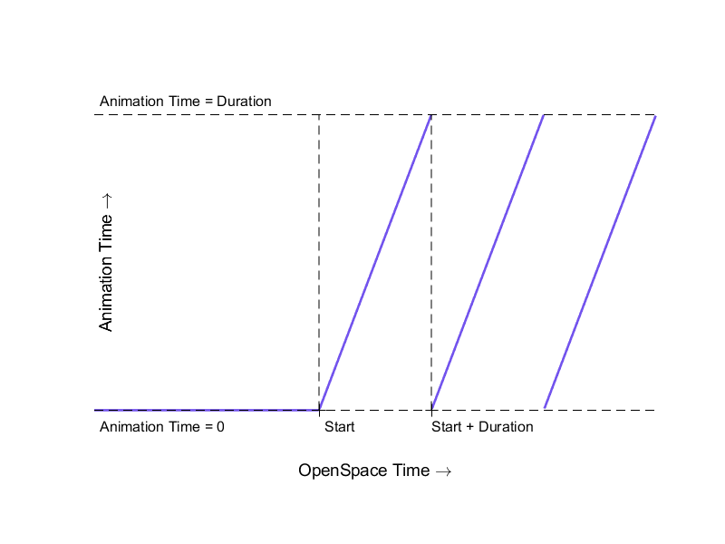
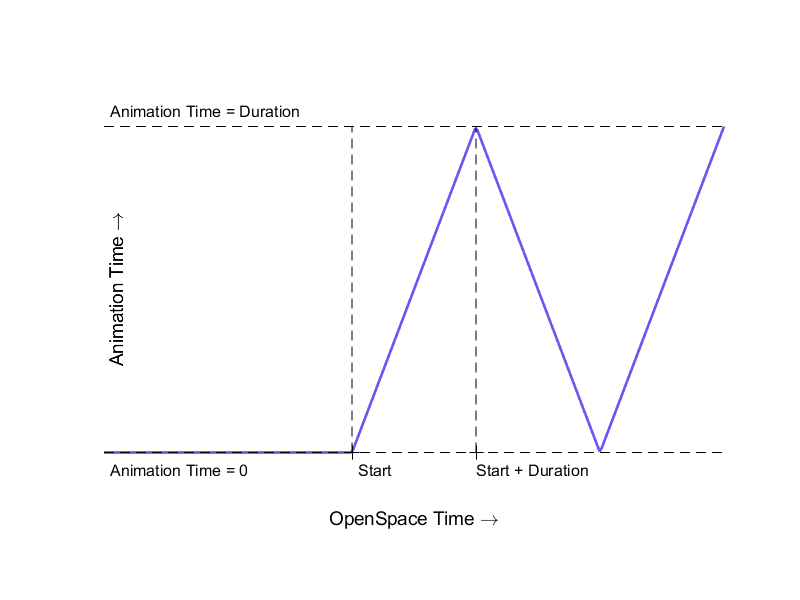

# Animation in OpenSpace
A new feature in release 0.17.0 of OpenSpace is that models with keyframe animations are now supported. Note that **only** keyframe animations are supported and not any other types of animations such as skinning or morphing.

## Import model with animation
To import a model that has an animation the model is added as normal in an asset file, for a more detailed description of how see [Loading Models](../models/model-loading). When OpenSpace imports the model, any animation it holds will automatically be imported as well. If an animation is imported but not activated there will be an info message in the log that the model has an animation that can be enabled.

~~~lua
  GeometryFile = models .. "BoxAnimated.glb",
~~~

## Settings
There are a few settings that you can set for your animation. If any of these settings is given to a model that does not have an animation there will be a warning message in the log.

### Start time
The start time is the date and time when the animation should start playing in OpenSpace. This is a string that should be strictly formatted in this way: <code>"YYYY MM DD hh:mm:ss"</code>. Note that only numbers are allowed, for example <code>"2021 04 15 11:50:00"</code> is a valid date and time while <code>"2021 APR 15 11:50:00"</code> is not. The start time is required to enable the animation in OpenSpace.

~~~lua
  GeometryFile = models .. "BoxAnimated.glb",
  AnimationStartTime = "2021 04 15 11:50:00",
~~~

### Enable
This setting is the only setting of the animation that can be changed during the runtime of OpenSpace in the GUI. This setting simply enables or disables the animation. When the animation is disabled the model goes back to its initial state. When the animation is enabled again, it goes back to the state it should have been in if the animation had always been enabled.

In conclusion, if you want to import a model with animation and enable it with the minimum amount of settings:

~~~lua
  GeometryFile = models .. "BoxAnimated.glb",
  AnimationStartTime = "2021 04 15 11:50:00",
  EnableAnimation = true,
~~~

### Time scale
Different animation software handles animation in different time scales and with this setting, you can adjust for this. OpenSpace expects the animation to be in seconds and if your animation is in a different unit you can set that here and it will scale the time of the animation accordingly.

~~~lua
  GeometryFile = models .. "BoxAnimated.glb",
  AnimationStartTime = "2021 04 15 11:50:00",
  EnableAnimation = true,
  AnimationTimeScale = "Millisecond",
~~~

### Modes
The animation can be played in a few different ways using different modes. The default animation mode is <code>"Once"</code>, which is to play the animation once starting from the given start time. Other options are: <code>"LoopFromStart"</code>, <code>"LoopInfinitely"</code>, <code>"BounceFromStart"</code>, and <code>"BounceInfinitely"</code>.

- **Once**, the animation is played once starting from the given start time. When the animation is finished it will remain in its last state.

- **LoopFromStart**, starts looping the animation from the start time. At any time before the start, the model rests in its initial state.

- **LoopInfinitely**, loops the animation both before and after the start time, where the animation is in its initial state at the start time.

- **BounceFromStart**, bounces the animation from the start time. At any time before the start, the model rests in its initial state. Bouncing the animation means that the animation is played once and then played again but backward, ensuring that the animation goes back to its initial state before it starts over. This avoids a potentially visible jump from the last state of the animation to the first state that you can get from looping it.

- **BounceInfinitely**, bounces the animation both before and after the start time, where the animation is in its initial state at the start time.

~~~lua
  GeometryFile = models .. "BoxAnimated.glb",
  AnimationStartTime = "2021 04 15 11:50:00",
  EnableAnimation = true,
  AnimationTimeScale = "Millisecond",
  AnimationMode = "BounceFromStart",
~~~
