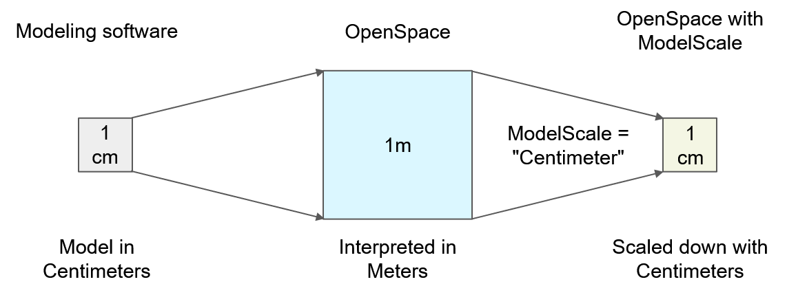
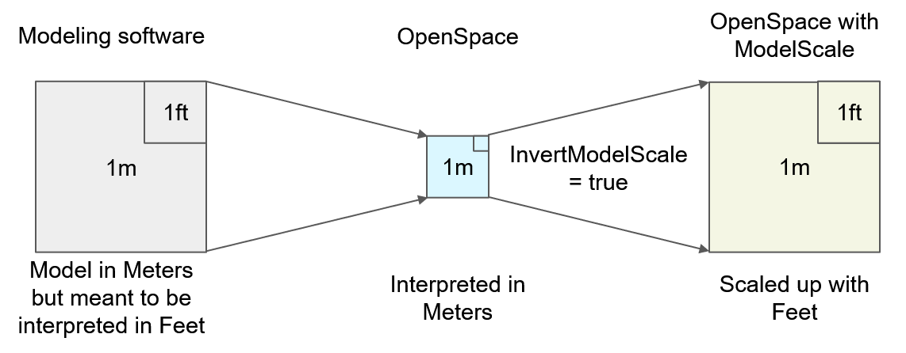
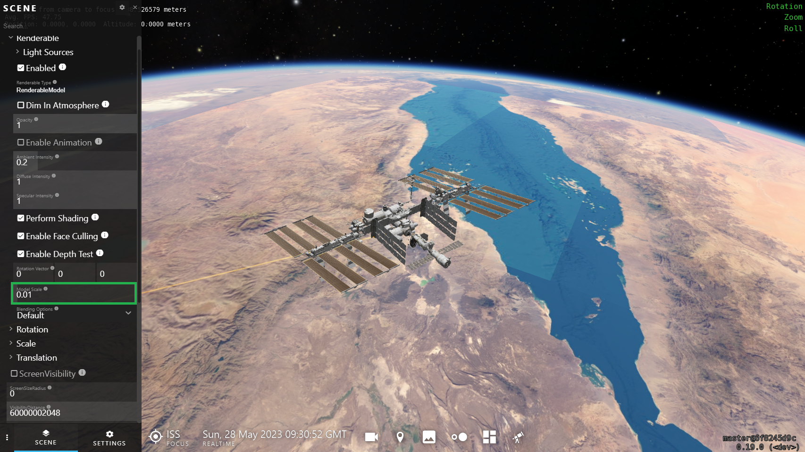

# Scaling of models
If a model looks too big or too small in OpenSpace, there are two different keys that can be used in the asset file to correct it. If the model is bigger than what is anticipated, then use the key <code>ModelScale</code> with a unit of scaling (often <code>"Centimeter"</code>) such as: 

```lua
  GeometryFile = models .. "/ISS.fbx",
  ModelScale = "Centimeter",
```

This unit comes from the software that the model originally was created in. Usually, the exact value for this is hard to find, so unfortunately this is a matter of trial and error to find the right one. Here is a list of all the available units:

```lua
  "Nanometer"
  "Micrometer"
  "Millimeter"
  "Centimeter"
  "Decimeter"
  "Meter"
  "Kilometer"
  "Thou"
  "Inch"
  "Foot"
  "Yard"
  "Chain"
  "Furlong"
  "Mile"
```

If instead, the model looks smaller than intended, then use the key <code>InvertModelScale = true</code> together with the previous key to invert the scaling and scale the model up instead of down, such as:

```lua
  GeometryFile = model .. "/JWSTFBX.osmodel",
  ModelScale = "Foot",
  InvertModelScale = true,
```

For more information read the following two sections, but for the most common cases, the tips above should be enough to get a correct scaling. The following text is more complicated and goes more in-depth into both cases.

## Scale Down
OpenSpace expects the models to be in the unit Meter, however, there are many models that are developed in a different unit, for example, Centimeters or Feet. Previously this scaling problem has been solved by applying a <code>StaticScale</code> to the model. In the release 0.17.0 there is a new tool that makes this easier. If you are aware that your model has been developed in Centimeters, or any other unit than Meters, you can specify that in the asset file with the key <code>ModelScale</code>:

```lua
  GeometryFile = models .. "/ISS.fbx",
  ModelScale = "Centimeter",
```

This will make OpenSpace interpret every unit in the model as Centimeters instead of Meters. If this scale would **not** be applied then every Centimeter in the model would be interpreted as Meters, and this would make the model look 100 times bigger than intended. So with the <code>ModelScale</code> the model is scaled down with the specified unit.



## Scale Up
In some cases, it would be useful to instead scale the model up with a specified unit. For example, if the model was developed in a Meter unit software but every Meter was treated as a Foot by the modeler. In this case, OpenSpace would interpret the Meters as Meters instead of as Feet and the model would appear smaller than what the modeler intended. If the <code>ModelScale</code> is applied to this model in a similar manner as before, OpenSpace would scale it down, making the model even smaller. So in this case the <code>ModelScale</code> needs to be inverted, scaling the model up, to show the model in the size that the modeler intended and this can be done with the key <code>InvertModelScale</code>:

```lua
  GeometryFile = model .. "/JWSTFBX.osmodel",
  ModelScale = "Foot",
  InvertModelScale = true,
```



## Scale with Numbers
It is also possible to give the <code>ModelScale</code> key a numerical value instead of a unit name to scale the model by an arbitrary value. If the value is smaller than 1 then the model is scaled down and if the value is bigger than 1 the model is scaled up.

```lua
  GeometryFile = models .. "/ISS.fbx",
  ModelScale = 0.01,
```

## Summary
In short, if the model was developed in a unit other than Meters then use the <code>ModelScale</code> key to scale the model down with that unit. However, if the model was developed in Meters but intended to be interpreted as another unit then the scale needs to be inverted with the key <code>InvertModelScale</code>. Unfortunately, the process of finding the correct model scale value is a matter of trial and error. However, since release 0.19.0 the numeric value of the <code>ModelScale</code> property is included in the GUI and can be changed at runtime with a slider. Note that this property is an <code>AdvancedUser</code> property and you might need to change your visibility settings to see it in the GUI.


