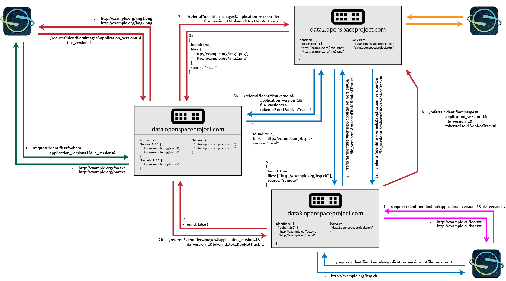

# Data Synchronization
Assets can make use of a versioned mechanism for synchronizing data files that are larger than would be comfortable to place into a Git repository.  These are called HTTPSynchronization and are used in assets like so:
```lua
local syncedDirectory = asset.syncedResource({
    Name = "General SPK Kernels",
    Type = "HttpSynchronization",
    Identifier = "general_spk",
    Version = 1
})
```
This command will download all files that correspond to the `general_spk` identifier for the file version `1` and provide the folder where the files were downloaded as a return value, `synchedDirectory` in this case.  This document describes how the identifier and version number are resolved through a network of servers that run custom NodeJS software called *BigBang*.

# Data endpoint usage
OpenSpace uses one of the *BigBang* servers as an endpoint,  the setting of which is done in the `openspace.cfg` file:
```lua
    Sync = {
        SynchronizationRoot = "${SYNC}",
        HttpSynchronizationRepositories = {
            "http://data.openspaceproject.com/request"
            -- "http://openspace.sci.utah.edu/request"
        }
    },
```
When requesting `general_spk` in file version `1`, OpenSpace will perform a web request to the provided repository and the request contains all information necessary to resolve the request.  In this case, the complete URL would be:  http://data.openspaceproject.com/request?identifier=general_spk&file_version=1&application_version1.  This URL will contain a list of files that are associated with this identifier and version, and OpenSpace will download all files contained in this file.

NB:  The application version is used to future-proof this setup and currently no other value than 1 is supported

# Server arrangement
Each *BigBang* server has a local mapping of (identifier, version, application version) to a list of files and a list of other servers it can ask for values that it does not recognize.  This builds a graph of *BigBang* servers that collectively contain all of the file information for all supported identifiers.

# Usage example

In this example, there are three different OpenSpace clients that each have a separate *BigBang* node as their endpoint.  The three nodes in this example, `data.openspaceproject.com`, `data2.openspaceproject.com`, and `data3.openspaceproject.com` are configured asymmetrically.  `data` knows about `data2` and `data3`, `data2` knows about `data` and `data3`, but `data3` is only aware of `data2`.

Each color in this image corresponds to a single request call to the endpoint and the different colors represent different usage scenarios:
1. Green:  OpenSpace requests an identifier and the endpoint _BigBang_ servers know about the identifier/version combination locally
2. Purple:  The same as green, but the location of the files might be different due to the proximity of the server to the requester.  (NB:  The servers are configured so that the **content** of the files is the same, even if they are provided at different URLs).
3. Orange:  The same as green and purple, but without much detail.
4. Red:  OpenSpace requests an identifier, but the endpoint server does not know about the identifier itself and has to get referrals from its known servers.  One of these directly knows about the identifier/version and returns them
5. Blue:  The same as red, but now neither the endpoint, nor a directly connected server knows about the identifier, so the connected servers need to enquire recursively.

Network messages in this example are numbered in the order in which they occur.  If two messages happen simultaneously, they are subdivided by letters (3a and 3b) are done in parallel and are both finished before 4 can happen.
