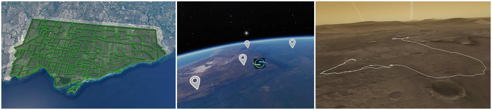
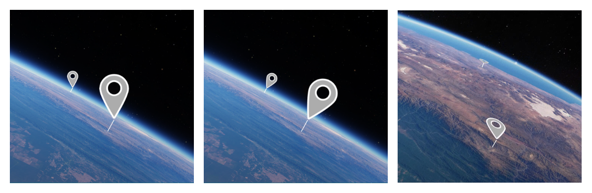

# Globe Geometry Features from GeoJson Files
As of version 0.19.0, OpenSpace includes support for drawing geometry features on a globe based on files in the [GeoJson](https://geojson.org/) file format. GeoJson is a format for encoding geographic data structures based on 2D or 3D geographic coordinates, with latitude, longitude and an optional altitude. It supports shapes like points, lines and polygons. See the GeoJson specification for more details. It is also possible to change the appearance of the resulting features based on some predefined available properties. See [this later section](#customize-visual-properties) for more details.

Some examples of features are shown below (polygons, points with textures, and lines).



Each GeoJson file loads a *collection* of features, which will make up a group of rendered features in OpenSpace, that can be toggled on/off, et cetera. In OpenSpace, the contents of a file are loaded into one property owner that will show up under the globe in the user interface, under "GeoJson". Due to the similarity to [Globebrowsing Layers](./working-with-layers.md), we refer to these as "GeoJson Layers", or "Globe Geometry Layers".

## Adding GeoJson features to a globe
There are two ways of adding GeoJson features to a selected globe: either directly from a .geojson file or by specifying a table in an OpenSpace asset. Once added, all content in a GeoJson file will appear as a component under "GeoJson" in the scene menu, as part of the globe it was added to.

### Creating a GeoJson asset
The preferred way to load a GeoJson file is to create an asset. This lets you load the file and add it to the correct globe, already at startup. It also lets you easily customize the visual properties of the rendered feature.

Adding GeoJson to a globe through an asset works very similarly to how a Globebrowsing Layer is added. An example is shown in the [Example](#example) section below.

### Add directly from a file, using drag and drop
If the current focus node is a globe, you can also drag and drop a GeoJson file in the OpenSpace window to add it to the currently focused node. The file's features will then be added with default values for all properties not included in the file. Under the hood, this simply calls the following Lua call, with the name of the file you dropped:

```
openspace.globebrowsing.addGeoJsonFromFile("filename.geojson")
```

## Customize visual properties
The visuals of the geometry features can be customized either through properties directly in the .geojson files, or through the `DefaultProperties` property of the main component created from the asset file.

The following table summarizes the available keys and properties. Note that the property identifier is also always a valid key in the GeoJson file.

| Property Identifier | Accepted keys (in .geojson file) | Value                                    | Description |
| ------------------- |--------------------------------- | ---------------------------------------- | ----------- |
| Name                | `name`                           | string                                   | This will be the name for the feature that shows in the "Features" menu in the UI |
| Description         | `description`                    | string                                   | (Not used anywhere right now, but will be shown in the UI in the future) |
| Opacity             | `opacity`                        | float, [0-1]                             | The opacity that will be used for drawing lines and points |
| Color               | `color`, `stroke`                | RGB (vec3, [0-1]) or hex value (string)  | The color that will be used for drawing lines and points. For points, the color will be blended with the color of the point texture |
| FillColor           | `fill`, `fill-color`             | RGB (vec3, [0-1]) or hex value (string)  | The color that will be used for drawing filled polygons and extruded geometry |
| FillOpacity         | `fill-opacity`                   | float, [0-1]                             | The opacity that will be used for drawing filled polygons and extruded geometry |
| Extrude             | `extrude`                        | boolean (`true`/`false`)                 | If true, extrude the geometry to intersect the globe. Lines/polygons will be extruded with polygons, and points with lines |
| AltitudeMode        | `altitudeMode`                   | string (`"absolute"` or `"relativeToGround"`) | Decides how any height values of the geo coordinates should be interpreted. "Absolute" means that the height is interpreted as the height above the reference ellipsoid (sea level), while "RelativeToGround" takes the height map into account |
| **Points Specific**          |                   |                              |  |
| PointSize           | `point-size`                     | float (> 0)                              | A value that will be used to decide the size of rendered points. The size will be scaled based on the bounding sphere of the globe   |
| PointTexture        | `texture`, `sprite`, `point-texture` | string (path to a texture)           | A texture to be used for rendering points |
| PointTextureAnchor  | `point-anchor`, `anchor`         | string (`"bottom"` or `"center"`)        | Decides the placement of the point texture in relation to the position. Default is at the bottom of the texture, but it can also be put at the center |

### Other useful properties and settings
In addition to the visual properties in the GeoJson files, some regular OpenSpace properties can be set for any loaded features. These can be used to navigate to a feature, change the visuals to match the projection system you are currently using, or just alter the look in general. These can not be set from a .geojson file, but through the Scene menu in the user interface, or in an asset.

#### Height offset, opacity, and scale
A few helper properties have been added to simplify changing some aspects of the visuals of the entire collection at once:

- *Opacity* - change the opacity of all features in a collection
- *Height Offset* - move the geometry up/down in relation to the reference surface (based on the height map or sea level, depending on chosen Altitude Mode)
- *Point Size Scale* - increase/decrease the size of any points in the collection
- *Line Width Scale* - increase/decrease the width of any rendered lines in the collection

#### Alignment of points
For points, it is possible to change how the texture planes align against the globe surface. There are four different options:

| Option           | Value | Description |
| ---------------- | :---: | ----------- |
| Camera Direction | 0     | Rotate the plane to face the camera view direction and alight the up-driection with the camera's up. Suitable for planar displays |
| Camera Position  | 1     | Use the camera's up direction, but rotate the plane to face the camera position instead of view direction. Suitable for spherical displays, such as domes or planetariums |
| Globe Normal     | 2     | Use the out-driection of the globe as the up direction |
| Globe Surface    | 3     | Align the plane flat along the globe surface |


Here are examples of points aligned with the Camera Direction, Globe Normal and Globe Surface options, respectively. The points have been extruded with a line that intersects the globe surface


#### Light sources
Polygon geometry can be lit using an OpenSpace light source (for example the Sun, or the Camera). Per default, a camera-based light source is added for all features.

Note that for the light source to make a visual difference, shading must be enabled for the feature (set under the `DefaultProperties` or in the GeoJson file).

### Tessellation (advanced)
Large geometry is split into smaller pieces and bent over the globe, to prevent the lines from intersecting the globe's surface. This "splitting" is known as tessellation, and does affect the performance of rendering the geometry. The more pieces the geometry is split into, the worse the performance.

<details markdown=block><summary markdown=span>More info</summary>

To give advanced users some control of that performance, tessellation can be enabled/disabled for each GeoJson layer. The degree of tessellation can also be controlled. See properties under the "Tessellation" owner for more details.

The tessellation properties can also be set per feature in the .geojson file. Here are the details for the available properties:

| Property Identifier              | Accepted keys (in .geojson file) | Value                    | Description |
| -------------------              |--------------------------------- | ------------------------ | ----------- |
| Tessellation.Enabled              | `tessellate`                     | boolean (`true`/`false`)| Decide whether or not to use tessellation. Default is `true` |
| Tessellation.TessellationDistance | `tessellationDistance`           | float, (> 0)            | The distance/resolution for the tessellation. Anythin larger than this distance will be split into smaller pieces |
| Tessellation.TessellationLevel    | `tessellationLevel`              | int                     | Decides how much to tessellate, in combination with the tessellation distance. The resulting distance used for the "splitting" is the tessellation distance divided by this value, so the larger the value, the smaller the pieces (and the more the performance will be affected)  |

</details>

## Example
Here is an example of a simple GeoJson file, with one single feature that has some specified properties.

*lines.geojson*
```json
{
  "type": "FeatureCollection",
  "features": [
    {
      "type": "Feature",
      "properties": {
        "stroke": "#e849fd",
        "stroke-width": 2,
        "stroke-opacity": 1
      },
      "geometry": {
        "type": "LineString",
        "coordinates": [[ -68.159, -16.426 ], [ -65.170, -19.062 ], [ -64.775, -21.535 ], [ -68.994, -22.391 ], [ -65.083, -15.496 ], [ -62.622, -15.665 ] ]
      }
    }
  ]
}
```

And an asset that loads the files, adds it to Earth, as well as specifies some default properties, to use for the properties that were not specified in the .geojson file

*lines.asset*
```lua
local ExampleLines = {
  Identifier = "Lines-Example",
  File = "lines.geojson",
  HeightOffset = 2000.0, -- Put the geomoetry 2000 meters higher than what's specified in the file
  DefaultProperties = {
    LineWidth = 2.0,
    Extrude = true
  },
  Name = "Example Lines"
}

asset.onInitialize(function()
  openspace.globebrowsing.addGeoJson("Earth", ExampleLines)
end)

asset.onDeinitialize(function()
  openspace.globebrowsing.deleteGeoJson("Earth", ExampleLines)
end)
```

More examples are available in the OpenSpace/data/assets/examples/geojson folder of your OpenSpace installation.

## Automatic flying to a feature
It is possible to fly to a GeoJson feature using the Scene menu. Each Feature collection and Feature has a "Fly to feature" button, that will trigger a camera path to that feature, framing it based on its latitude and longitude coordinates.

## Known issues
The GeoJson support implemented in 0.19.0 is a first iteration and may be subject to changes in the future. It also includes some known issues that we intend to fix down the line. Here is a summary of those issues:

* The performance of the rendering is suffering when a feature consists of a lot of triangles, or when loading files with lots of features
* The motion generated by the "fly to" feature is currently a bit weird when flying between things on a planet surface. This will be improved in the future.
* One remaining altitude mode to implement is "Clamp to ground", which will render the geometry as a texture on the surface and follow the height map exactly. Until that's implemented, we refer to our regular layer system (ColorLayers or Overlays) for such use cases.

