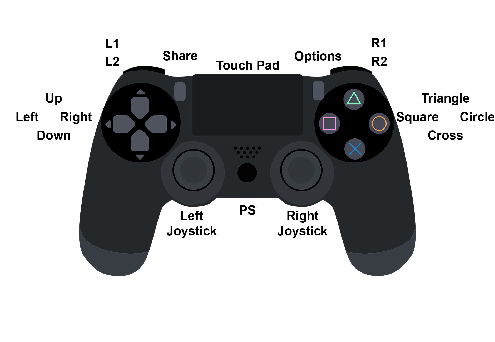
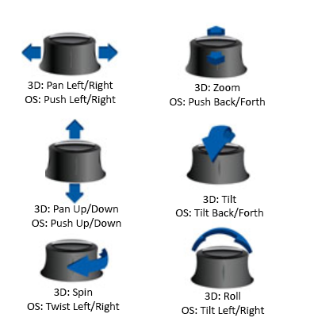

# Joystick Navigation
In addition to the normal navigation in OpenSpace using the keyborad and mouse it is also possible to navigate using a game controller, such as an Xbox controller, PS4 controller or a SpaceMouse. If you want to use any of these supported joysitck you need to include their asset file into a profile. This can be done in the profile editor in the launcher by editing the profile to include one of the joystick assets. All of the joystick assets are located in the sub-folder <code>data/assets/util/joysticks</code> in the location of your OpenSpace folder. It is important that you include the right asset file for the type of game controller you are using. For example the wireless Xbox asset will not work with a non-wireless Xbox controller and vice versa.

## Xbox Controller
The navigation using an Xbox or PS4 controller are very similar, the only difference is the layout of the controllers. Otherwise the functionality is the same. The image below shows a map over the buttons and joysticks on a Xbox controller.

The navigation using a Xbox controller in OpenSpace is defined in the xbox asset file <code>(data/assets/util/joysticks/xbox.asset)</code> or the Xbox wireless asset file <code>(data/assets/util/joysticks/xbox-wireless.asset)</code>. The table below will give an overview of what each button or joystick on the Xbox controller does in OpenSpace. NA in the table specifies that this button or joystick has no functionality in the default version.

| Button | Description |
|--------|-------------|
| A | Toggle zoom friction |
| B | Toggle rotation friction |
| X | Switch focus to Earth |
| Y | Switch focus to Mars |
| LB | Pressed: Switch to local roll mode. Released: Switch back to normal mode |
| LT | Zoom out |
| RB | Pressed: Switch to global roll mode. Released: Switch back to normal mode |
| RT | Zoom in |
| Up | NA |
| Right | NA |
| Left | Toggle roll friction |
| Down | NA |
| Left Joystick up/down | Orbit around focus up/down |
| Left Joystick left/right | Orbit around focus left/right |
| Left Joystick Press | NA |
| Right Joystick up/down | Pan camera up/down |
| Right Joystick left/right | Pan camera left/right |
| Right Joystick Press | NA |
| Select | NA |
| Start | NA |

## PS4
The image below shows a map over the buttons and joysticks on a PS4 controller.

The navigation using a PS4 controller in OpenSpace is defined in the PS4 asset file <code>(data/assets/util/joysticks/ps4.asset)</code>. The table below will give an overview of what each button or joystick on the PS4 controller does. NA in the table specifies that this button or joystick has no functionality in the default version of OpenSpace.

| Button or joystick | Description |
|--------------------|-------------|
| Cross | Toggle zoom friction |
| Circle | Toggle rotation friction |
| Square | Switch focus to Earth |
| Triangle | Switch focus to Mars |
| L1 | Pressed: Switch to local roll mode. Released: Switch back to normal mode |
| L2 | Zoom out |
| R1 | Pressed: Switch to global roll mode. Released: Switch back to normal mode |
| R2 | Zoom in |
| Up | NA |
| Right | NA |
| Left | Toggle roll friction |
| Down | NA |
| Left Joystick up/down | Orbit around focus up/down |
| Left Joystick left/right | Orbit around focus left/right |
| Left Joystick Press | NA |
| Right Joystick up/down | Pan camera up/down |
| Right Joystick left/right | Pan camera left/right |
| Right Joystick Press | NA |
| Share | NA |
| Options | NA |
| PS | NA |

## SpaceMouse
The SpaceMouse is a joystick with 6 degrees of freedom that is sold by the company [3Dconnexion](https://3dconnexion.com/uk/spacemouse/). There are a few different versions of it and therefor thare are a few different versions of the asset files that specify the navigation. The versions that are currently supported (as of release 0.18.0) is the SpaceMouse Compact <code>(data/assets/util/joysticks/space-mouse-compact.asset)</code> and the SpaceMouse Enterprise <code>(data/assets/util/joysticks/space-mouse-enterprise.asset)</code>, both of which can be in wireless mode <code>(data/assets/util/joysticks/space-mouse-compact-wireless.asset and data/assets/util/joysticks/space-mouse-enterprise-wireless.asset</code>). The image below is a map of the different movements of the SpaceMouse and a translation from the terminology used by 3Dconnexion (3D) and the terminology used by OpenSpace (OS).

The table below will give an overview of what each button or joystick on the SpaceMouse does. The Left and Right buttons are only supported for the Compact version of the SpaceMouse. However, if you are using the Enterprise version you can bind some of the buttons to a regular key on the keyboard and bind actions to them, read more about this [here](basic-navigation) and [here](../../builders/profile_syntax).
| Button or joystick | Description |
|--------------------|-------------|
| Push left/right | Orbit around focus left/right |
| Push back/forth | Orbit around focus up/down |
| Push up/down | Zoom in/out |
| Twist left/right | Pan camera left/right |
| Tilt left/right | Roll camera left/right |
| Tilt up/down | Pan camera up/down |
| Left button | Switch to local roll |
| Right button | Switch to global roll |
